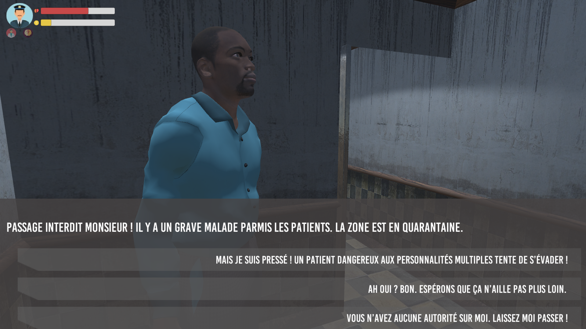

# Breaking Order - WonderJamHiverUQAC2018 - Développé en 48 heures 

Vous vous réveillez dans la peau d'Ernest avec une seule envie: vous échapper de l'asile dans lequel on vous a interné de force. Découvrez vos multiples personnalités et utilisez les à bon escient pour tromper les gardes et le personnel médical. Frayez vous un chemin vers la sortie, et à vous la liberté !

## Features développé intégralement par moi même 
- Déplacement du personnage : 
	- Caméra
	- Gestion des animations
	- Sons
- IA des gardes, s'inspire du fonctionnement des gardes dans Assasin'S Creed :
	- Dispose d'une barre de détection , une fois le joeur detecté le garde vous pourchassera et sa barre augmentera, lorsque sa barre augmente cela augmente sa vitesse. Attention si sa barre atteint son niveau maximal vous avez perdu.
	- Dispose d'une barre de détection , une fois le joeur detecté le garde vous pourchassera et sa barre augmentera, lorsque sa barre augmente cela augmente sa vitesse. Attention si sa barre atteint son niveau maximal vous avez perdu.
	- Les gardes vous détectent si vous incarnez votre personnalité de patient ou de médecin.
	- Vous pouvez utiliser votre personnalité de garde afin de les eviter attention si vous changer de personnalité devant eux ils vous reconnaitront !
	- Les gardes continueront de vous pourchasser sauf si ils vous perdent de vue pendant 2 secondes.
	- La barre des gardes n'augmente que lorsqu'ils vous ont réellement en vue même si ils sont dans un état de poursuite.
	-  Les gardes cesseront de vous pourchasser si ils vous perdent de vue pendant plus de 2 secondes. Leurs barre de détection et leur vitesse reviendra peut à peu à leurs valeur initiale.
	- Gestion des animation et  sons de détection.
- GameManager :
	- Ajout des conditions de défaites. Détection par un garde ou barre de soupçon qui atteint sa valeur maximal.
	- Ajout de la ocndition de transistion de la scène tutoriel au niveau principal.
	- Ajout de la condition de victoire du jeu.
## Implication dans les autres features
- Débbuggage du fonctionemment des dialogues.
- Amélioration dans l'affichage de l'UI pour intéragir avec les PNJ ou les portes
- Amélrioration du sytème de mise en pause lors d'intéraction avec les personnages
- Build Final en corrigeant le fonctionnement des portes et des PN
## Comment jouer ?

You just have to run OP_GM.exe
 
## Controles
La plus part des mécaniques sont expliqués dans le jeu toute fois je vais dresser quelqus explications supllémentaires ici :
	- Une fois que vous serez en possesion de vos 3 personnalités (Vous devz trouver les 3 carnets bleues). Vous pourrez passer au vrai niveau.
	- Vous disposez d'une qéquence de dialogue par personnalité et par PNJ ! 
	- Attention une fois que vous avez parlé avec un PNJ en incarnant uen perosnnalté vous ne pourrez plus lui parler avec cette même personnalité. 
	- Certain PNJ peuvent vou ouvrir des portes afin d'éviter les gardes.
## Conclusion
Une très bonne expérience. Première GameJam pour moi, cela m'a permis de mettre en pratique mes conaissances et d'en apprendre de nouvelles. Satisfait du jeu puisque nous avons fait puisque nous avons respecté le thème imposé par Ubisoft : Ordre et Désorde. Ainsi que les styles qui nous ont été imposés : Dialogue, Survie et Stratégie.

## Authors

* **Sacha Vanleene - Developper** 
* **Ayoub Al Haddan - Developper**
* **Julien Cusset - Developper**
* **Esmé James - Developper**
* **Théo Debay - Developper**
* **Wilfried Pouchous - Developper**
